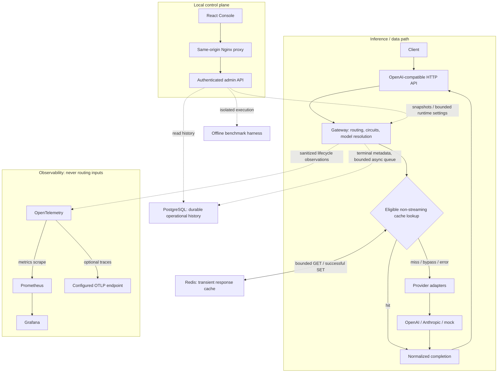

# RouteForge

[](https://github.com/VincentSh1/RouteForge/actions/workflows/go-ci.yml)
[](https://github.com/VincentSh1/RouteForge/actions/workflows/compose-smoke.yml)

RouteForge is a Go inference gateway for OpenAI-compatible chat completions.
It makes provider selection, fallback, latency, and configured cost explicit—and
keeps operational history separate from request content.

The project explores how to serve across heterogeneous providers without letting
monitoring, caching, or durable history become routing dependencies. It is a
modular monolith, not a semantic-quality router or a production deployment platform.

[Run locally](#run-the-local-demo) · [Architecture](#architecture) ·
[Measured results](#measured-performancenot-production-capacity) ·
[Portfolio brief](docs/portfolio.md) · [Release notes](CHANGELOG.md)

## What it does

- Synchronous and streaming completions through OpenAI, Anthropic, or a
  credential-free mock adapter.
- Four routing policies, typed fallback, circuit breakers, and deterministic exploration.
- Fail-open Redis response caching and bounded asynchronous PostgreSQL operational history.
- Optional OTel tracing, Prometheus metrics, provisioned Grafana monitoring,
  example SLOs, and alert rules.
- A local authenticated React Console for history, provider/routing snapshots,
  offline policy comparisons, and bounded runtime routing settings.
- Deterministic counterfactual routing benchmarks and a separate real HTTP load suite.

**Status:** portfolio milestone candidate. The supported full-stack workflow is
the local mock demo below. See [limitations](#known-limitations) and
[unreleased milestone notes](CHANGELOG.md); this is not a claim of internet-facing
production readiness.

## Run the local demo

Prerequisite: Docker with Compose. No local Go/Node installation or paid
provider credentials are needed.

1. Generate a high-entropy **32–256-byte admin secret** in your password manager.
   Set `ROUTEFORGE_ADMIN_SECRET` in your shell environment or ignored root
   `.env` file. Do not commit it, print resolved configuration, or reuse a
   production credential. Keep the value for Console login.
2. From the repository root:

   ```sh
   docker compose up --build -d --wait
   ./scripts/generate-demo-traffic.sh
   ```

3. Open the Console and log in with that secret:

| Interface | Local address | Purpose |
| --- | --- | --- |
| RouteForge Console | http://127.0.0.1:3001 | History, providers, benchmarks, routing settings |
| Grafana | http://127.0.0.1:3000 | Provisioned **RouteForge Overview** time-series dashboard |
| Prometheus | http://127.0.0.1:9091 | Optional query/target debugging |
| Inference API | http://127.0.0.1:8080 | `GET /health`, `POST /v1/chat/completions` |
| Admin API | http://127.0.0.1:8081 | Session-protected operational API |

Compose starts RouteForge, Console, PostgreSQL, Redis, Prometheus, and Grafana.
It uses **mock only**, enables persistence/cache/metrics/admin authentication,
and leaves OTLP tracing off. The traffic script sends 40 bounded synchronous and
streaming requests; do not switch to paid providers when running the demo.

Grafana has local anonymous Viewer access, separate from Console authentication.
Allow multiple 15-second scrapes for rate panels to populate. Successful mock
traffic may leave fallback/circuit panels empty; nothing is fabricated.
Mock pricing is fictional: USD 2 input / USD 8 output per million tokens,
solely for demonstrating accounting.

All published ports bind host loopback. PostgreSQL, Redis, and RouteForge's
metrics port are not host-published. Container-wide listener binds are explicit
Compose overrides, not changes to standalone defaults.

```sh
docker compose down       # Stop; retain PostgreSQL, Prometheus, and Grafana volumes.
docker compose down -v    # Also DELETE local history and monitoring data.
```

Redis is intentionally ephemeral: no data volume, AOF, or RDB persistence.
For startup/login troubleshooting and native development, see
[development](docs/development.md).

### Demo walkthrough and screenshots

Use the [real-data capture guide](docs/demo.md) for Overview, Providers & Routing,
request/attempt history, benchmark comparisons, and Grafana. It includes exact
views, captions, and a short walkthrough. Screenshots are pending manual capture;
no simulated UI images or fabricated traffic are presented as measurements.
The [portfolio brief](docs/portfolio.md) provides evidence-linked resume bullets
and 30-second/two-minute explanations without duplicating the API reference.

## Architecture

Solid arrows show inference and synchronous cache access; dotted arrows show
supporting observation/control paths.



The OTLP destination is operator-supplied, not another default-stack service.
Routing uses process-local telemetry, circuits, and configured pricing; it never
queries PostgreSQL, Prometheus, Grafana, or Redis to choose a provider.

[Architecture and design decisions](docs/architecture.md) explains stream
commitment, state ownership, failure boundaries, and tradeoffs.

## Routing policies

Policies reorder eligible candidates in **auto** mode; explicit-provider mode
does not redirect requests.

| Policy | Decision | Tradeoff |
| --- | --- | --- |
| `deterministic` | Configured provider order | Stable behavior; no latency adaptation |
| `latency` | Fresh rolling median completion latency or streaming TTFC | Needs sufficient samples; deterministic warm-up exploration and switching margin |
| `cost` | Configured input/output price dominance | Not a prompt-token forecast; incomparable/missing prices retain stable order |
| `cost_latency` | Cost preference inside an explicit latency-over-fastest tolerance | Needs fresh telemetry; slower candidates remain fallback options |

Fallback requires an eligible typed failure before stream commitment.
TTFC means first non-empty assistant content, not complete stream duration.
No policy measures correctness, human preference, or semantic quality.
See [routing/model configuration](docs/configuration.md#routing-policies).

## Measured performance—not production capacity

| Tool | What it measures | Evidence |
| --- | --- | --- |
| Offline routing benchmark | Four policies under identical simulated outcomes and virtual time | [Versioned scenarios and reproduction](benchmarks/README.md) |
| HTTP load suite | Real local HTTP/concurrency, cache, and persistence overhead against mock | [Methodology and raw reports](benchmarks/performance/README.md) |

The checked-in HTTP runs used a macOS arm64 Go 1.26.6 client (8 logical CPUs)
and a Colima Linux arm64 Docker VM (4 CPUs, about 5.8 GiB RAM), PostgreSQL 17.11,
and an immediate mock provider. Client and services shared host resources.

- **Short bursts:** 24 cases, 1,000 measured requests each, concurrency 1/8/32/64.
  Windows lasted 0.049–0.771 seconds. All 24,000 HTTP requests succeeded,
  but persistence-enabled cases dropped 6,095 of 12,000 history records.
- **Sustained comparison:** cache disabled, concurrency 8/32/64, 2,000 excluded
  warm-up requests and 30-second windows; one run per case.
  Per-request pgx batching increased interior-window persistence throughput
  **1.58–1.74×** versus the identically instrumented sequential writer.

| Concurrency | Persisted records/s before → after | History dropped after |
| ---: | ---: | ---: |
| 8 | 773 → 1,337 | 85.92% |
| 32 | 387 → 610 | 95.30% |
| 64 | 279 → 487 | 97.03% |

Rates use samples near seconds 5–25; drop fractions cover the whole measured
window after drain. At concurrency 32/64, the improved persistence run coincided
with roughly 8%/6% lower HTTP throughput and 11%/6% higher client p95.
Every enabled sustained case still saturated the queue. **HTTP success does not
imply durable history coverage.** No no-drop threshold, confidence interval,
real-provider capacity, or universal RPS claim is established. Raw reports
retain dirty-source provenance, not clean-release benchmark certification.

## Security and privacy boundaries

- PostgreSQL stores operational metadata, **not prompts, responses, bodies,
  credentials, user identities, or raw provider errors**.
- Redis values contain generated response content: sensitive transient data.
  Hashed keys are not encryption or tenant isolation.
- Console sessions are bounded, in-process, HttpOnly, SameSite=Strict, and expire.
  Credentials come from config/environment, not frontend bundles or browser storage.
- Admin APIs are default-off and loopback by default. Compose keeps them local
  and authenticated. Routing writes require a session and trusted Origin.
- Metrics avoid user-content/high-cardinality labels; internal/provider/database
  errors are sanitized. Model names remain operational metadata—do not put
  sensitive content in them.
- Inference is unauthenticated; Grafana and Prometheus are not protected by
  Console login. Remote/shared use still requires TLS, protection of other exposed
  interfaces, and deployment-boundary security.

See [security tradeoffs](docs/architecture.md#security-boundaries). This is not a
claim of a completed security audit or a multi-tenant service.

## Repository guide and validation

| Location | Responsibility |
| --- | --- |
| `cmd/routeforge`, `internal/httpapi`, `internal/gateway`, `internal/provider` | Inference, routing/resilience, adapters |
| `internal/persistence`, `internal/cache`, `internal/accounting` | History, response cache, configured economics |
| `internal/adminapi`, `web/` | Authenticated control plane and React Console |
| `internal/observability`, `deploy/observability/` | Tracing, metrics, provisioning, alerts |
| `internal/benchmark`, `benchmarks/v1/` | Deterministic policy comparisons |
| `cmd/routeforge-load`, `internal/loadtest`, `benchmarks/performance/` | Bounded real HTTP measurements |
| `scripts/`, `.github/workflows/` | Local validation and CI |

[Development/check commands](docs/development.md) ·
[Configuration/inference reference](docs/configuration.md) ·
[Control-plane reference](docs/control-plane.md) ·
[Observability/SLO reference](docs/observability.md)

Fast CI runs Go vet/tests/race, frontend typecheck/tests/build, and byte-identical
offline replay. Separate Compose smoke tests actual mock traffic, auth/routing
controls, cache fail-open, PostgreSQL consistency/restart durability, Console
proxying, and Prometheus/Grafana provisioning. Performance suites remain manual,
not noisy PR gates. Tests do not call paid providers.

## Known limitations

- A supported subset of OpenAI chat completions, not the entire API; unsupported
  JSON fields are ignored, not forwarded as generation options.
- Process-local routing/circuit/telemetry/session/runtime-setting state resets on
  restart. Runtime configuration is not durable or coordinated across replicas.
- History is bounded best-effort persistence, not a lossless audit log. No automatic
  retention job exists; operators must manage database/monitoring storage.
- Response caching intentionally reuses eligible results across identical requests;
  no streaming cache, caller isolation, or stampede prevention.
- Single-admin local control plane; no users, roles, remote deployment platform,
  or general inference abuse protection.
- Synthetic policy experiments measure system performance/economics, never
  semantic quality. Single-machine load results require workload qualification.

Licensed under [MIT](LICENSE). No release or tag is created by these milestone notes.
